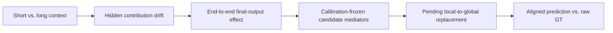

# Camera Hidden Causal Tracing Findings

## Scope

This analysis connects two prediction-only experiments at the shared identity
`(refinement_iteration, hidden_unit)`:

1. **Context drift:** which Camera Head hidden contributions change most when
   the same target frames are processed with short versus long context.
2. **End-to-end effect:** which hidden positions have the largest propagated
   effect on final translation, rotation, or FoV after all remaining Camera
   Head refinements.



The intersection identifies candidate mediators. It does not yet prove that a
hidden change causes GT error or that replacing it will improve the trajectory.

## Top-64 Definition

The search space contains `4 x 1024 = 4096` hidden positions. For each output
group, the old experiment selects the 64 largest context-drift positions and
the new experiment selects the 64 largest end-to-end causal effects. An overlap
of `41/64` means that 41 identities occur in both size-64 sets. The value 64 is
a frozen sparse-intervention budget, not a learned threshold.

## Calibration and Holdout

Candidates are selected from calibration only. Holdout never refits the
normalization or changes the frozen candidate set.

| Output | Calibration overlap | Independent holdout overlap | Frozen candidates retained in both holdout top-64 lists | Stable preference in both splits |
| --- | ---: | ---: | ---: | ---: |
| Translation | 41/64 | 41/64 | 39/41 | 29/41 |
| Rotation | 23/64 | 26/64 | 23/23 | 9/23 |
| FoV | 12/64 | 12/64 | 11/12 | 11/12 |

The ordering `translation > rotation > FoV` therefore describes the strength
of the trace from context-sensitive hidden drift to final-output sensitivity.
It does **not** compare error magnitudes across meters, degrees, and FoV units.

The causal atlas itself is stable across splits:

| Output | Calibration-holdout Spearman | Causal top-64 overlap |
| --- | ---: | ---: |
| Translation | 0.973 | 61/64 |
| Rotation | 0.971 | 62/64 |
| FoV | 0.965 | 59/64 |

## Refinement Finding

All end-to-end causal top-64 positions for translation, rotation, and FoV fall
in `iteration 0`, the first Camera Head refinement. The experiment ranked all
4096 positions; it did not preselect the first refinement. At one natural RMS
activation, iteration 0 contributes approximately 97.5%-97.9% of the aggregate
causal effect across the three output groups.

This localizes the strongest propagation path to:

`first refinement -> complete shared trunk -> pose_branch post-GELU hidden ->
fc2 pose delta -> remaining refinements -> final camera output`.

It does not identify an individual Transformer block because the trace is
captured after the complete shared trunk.

## Validation Boundary

Direct projection checks support translation and FoV: holdout median relative
errors are approximately 1.3% for both. Rotation has a 98.5% median relative
error, concentrated in iterations 1-3 where the expected angles are extremely
small. The current evidence is consistent with a float32
`trace -> arccos` numerical floor, but rotation magnitude remains unverified
until a robust SO(3) or normalized-quaternion direct check is rerun.

The next causal step is a calibration-frozen local-hidden-to-global-hidden
replacement. Any metric containing predictions must use aligned predictions;
GT must remain raw. Holdout must report the frozen intervention without
reselecting units.

## Provenance

- Context attribution calibration: `bba0cdf_28eadd33cbf8`
- Context attribution holdout: `bba0cdf_09e64725a56d`
- Causal atlas calibration: `9368808_99c8a9ed393c`
- Causal atlas holdout: `9368808_1d91735181c4`
- ScanNet split digest:
  `69c283245c4f220965e6fde3b96192de298e292eb8ca625c94851fe8932cdb8a`

The local overview figure is generated from the four numeric CSV files with:

```bash
python -m pre_experiments.camera_hidden_state_attribution.visualize_causal_trace \
  --old-calibration results/camera_hidden_state_attribution/results/bba0cdf_28eadd33cbf8/per_unit.csv \
  --old-holdout results/camera_hidden_state_attribution/results/bba0cdf_09e64725a56d/per_unit.csv \
  --causal-calibration results/camera_hidden_causal_preference/results/9368808_99c8a9ed393c/per_position.csv \
  --causal-holdout results/camera_hidden_causal_preference/results/9368808_1d91735181c4/per_position.csv \
  --output results/camera_hidden_causal_preference/figures/causal_trace_overview.png
```
