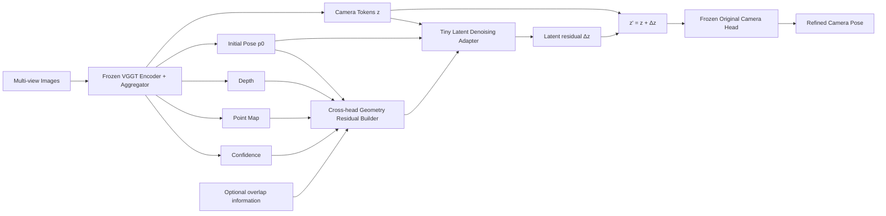
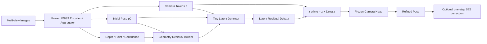

# VGGT × DiT：Camera Latent Denoising 与 Geometry Residual Refinement 技术研究指南

> **研究目标**：在不重新训练 VGGT 主干的前提下，借鉴 DiT 的表征演化、条件调制和残差去噪思想，改善 VGGT 的 Camera Pose 稳定性、跨视角一致性与长序列鲁棒性。优先考虑 **training-free**，其次是只训练数百万参数以内模块的 **small-scale SFT**。

---

## 1. 研究边界与基本约束

### 1.1 资源约束

本研究默认满足以下条件：

- 不进行 VGGT 全量预训练或大规模 finetuning；
- VGGT Image Encoder、Aggregator 和原始预测 Heads 原则上保持冻结；
- 优先开展 inference-time / training-free 实验；
- 需要训练时，只更新小型 Adapter、Refiner、LoRA 或少量 Head 参数；
- 新模块应直接作用于数量很少的 Camera Tokens 或低维 Pose 变量，避免处理全部 Patch Tokens；
- 第一阶段以验证研究假设为目标，而不是立即追求完整系统指标。

### 1.2 核心研究问题

本研究需要回答两个层次不同的问题：

1. **表征问题**：VGGT 最终 Camera Token 是否已经包含正确几何信息，只是受到噪声、上下文不足或错误 correspondence 的干扰？
2. **解码问题**：Camera Token 本身是否足够，但现有 Camera Head 缺少显式几何反馈，因而不能稳定地把表征解码为 Camera Pose？

这两个问题分别对应：

- **方向一：Camera Latent Denoising**；
- **方向二：Geometry Residual Refinement**。

---

# 2. 先理解 VGGT Camera Head 的真实基线

## 2.1 不应把 VGGT 简化成单次 MLP 回归

VGGT 的 Camera Head 不是简单的：

```text
Camera Token → MLP → Pose
```

更准确的抽象是：

```text
最终 Camera Tokens z
        │
当前 Camera Pose p_k → Pose Embedding
        │
        ▼
Pose-conditioned feature modulation
        │
        ▼
Small Transformer trunk
        │
        ▼
预测 Camera residual Δp_k
        │
        ▼
p_{k+1} = p_k + Δp_k
```

可写为：

\[
z=A(I),
\qquad
p_{k+1}=p_k+f_\theta(z,p_k),
\]

其中：

- \(A\) 是 VGGT 的图像编码与多视角 Aggregator；
- \(z\) 是最终 Camera Token 表征；
- \(p_k\) 是第 \(k\) 次相机状态；
- Camera Head 逐步更新 Pose；
- 在 Camera Head 的迭代期间，\(z\) 通常保持不变。

## 2.2 这一事实对研究设计的影响

因此，下面这种想法本身不够新：

```text
Pose_0 → predict ΔPose → Pose_1 → predict ΔPose → Pose_2
```

因为现有 VGGT Camera Head 已经具有 Pose residual refinement。

真正值得研究的是：

1. **更新 latent，而不只是更新 pose**；
2. **给 residual update 提供显式几何误差，而不只是固定 Camera Token**；
3. **让 refinement 形成 closed loop，而不是 open-loop guess**。

这构成后续两个方向的创新边界。

---

# 3. 方向一：Geometry-Guided Camera Latent Denoising

## 3.1 核心假设

将最终 Camera Token 看成“几何信号 + 表征噪声”的混合：

\[
z=z_{\text{geometry}}+z_{\text{noise}}.
\]

噪声不一定是随机高斯噪声，更可能来自：

- 视角重叠不足；
- 帧数较少或上下文截断；
- 纹理重复或弱纹理；
- 动态目标与遮挡；
- 模糊、曝光变化和图像退化；
- Sliding Window 局部视野不足；
- 错误跨视角 correspondence；
- 不同窗口参考坐标系的 gauge 差异。

现有 Camera Head 在固定 \(z\) 上反复更新 Pose。如果 \(z\) 本身有偏，Head 只能从同一个有偏表征中反复猜测修正量。

因此方向一的目标是：

\[
\tilde z=D_\phi(z, r_{\text{geo}}, e(p_0)),
\]

然后使用冻结的原始 Camera Head：

\[
\hat p=H_{\text{cam}}(\tilde z).
\]

其中：

- \(D_\phi\)：轻量 Camera Latent Denoiser；
- \(r_{\text{geo}}\)：由多个 VGGT Head 构造的几何残差信号；
- \(e(p_0)\)：初始相机状态的 embedding；
- \(H_{\text{cam}}\)：冻结的原始 VGGT Camera Head。

## 3.2 方向一的核心架构



## 3.3 为什么是 latent denoising，而不是完整 diffusion

不建议直接训练完整 Camera Diffusion Model，原因包括：

- 训练预算与数据需求过大；
- Camera Pose 空间和 Camera Token 空间的噪声分布尚未定义；
- 多步采样会增加推理成本；
- 很难证明收益来自 DiT 表征，而不是更大的网络；
- Camera Head 自身已经有多轮 residual update。

更现实的实现是 **one-step denoising residual**：

\[
z'=z+\Delta z.
\]

这个形式保留了 DiT 的关键思想：

- 当前状态是受噪声影响的 latent；
- 更新受条件信息调制；
- 网络预测 residual，而非完全重建输出；
- 使用零初始化保证初始行为与原 VGGT 一致；
- 主干冻结，只训练小型去噪模块。

## 3.4 推荐的小型模块

### 方案 A：Bottleneck Tiny Transformer

```text
Camera Tokens [S, 2048]
        │
Linear Down: 2048 → 256
        │
2-layer Tiny Transformer
        │
Cross-attend geometry residual tokens
        │
Linear Up: 256 → 2048
        │
Δz
        │
z' = z + Δz
```

建议：

- Adapter hidden size：128–384；
- Transformer layers：1–3；
- heads：4–8；
- 仅处理每帧一个 Camera Token；
- 输出投影层零初始化；
- 主干全部冻结；
- 参数量控制在约 1M–5M。

### 方案 B：AdaLN-style Camera Denoiser

借鉴 DiT 的条件调制：

\[
\operatorname{AdaLN}(z; c)=
\gamma(c)\odot \operatorname{LN}(z)+\beta(c),
\]

其中 condition \(c\) 可包含：

- 当前 Camera Pose embedding；
- 跨 Head 几何 residual；
- 每帧 confidence；
- window position；
- overlap frame indicator；
- denoising/refinement step embedding。

这比简单 concat 更贴合 DiT 的表征调制范式。

## 3.5 真实 noisy–clean token 对的构造

### 不推荐：只加 Gaussian noise

\[
z_t=\alpha_t z+\sigma_t\epsilon
\]

这种方法容易学成普通 feature denoising，却不一定修复真实相机误差。

### 推荐：Clean–Degraded Context Pair

Teacher 输入：

- 更多视角；
- 更长上下文；
- 较高图像质量；
- 更高 overlap；
- 相同或稳定的参考帧。

Student 输入：

- 帧丢弃；
- 短窗口；
- 低 overlap；
- 模糊、遮挡或曝光扰动；
- 受限分辨率；
- 局部帧序列。

冻结 VGGT 分别得到：

\[
z^+=A(I_{\text{clean}}),
\qquad
z^-=A(I_{\text{degraded}}).
\]

训练目标：

\[
D_\phi(z^- , r_{\text{geo}})\rightarrow z^+.
\]

### Gauge 问题

Camera Token 并没有唯一的物理 Ground Truth。不同帧集、不同参考帧或不同窗口可能对应不同 gauge，因此不能盲目做原始 Token MSE。

优先选择：

1. Teacher 与 Student 使用相同参考帧；
2. 对齐解码后的 relative pose；
3. 对齐 token pairwise relations；
4. 在 Sim(3)/SE(3) 对齐后计算几何损失；
5. 使用 projector 后的 cosine alignment，而非直接高维 MSE。

## 3.6 推荐损失

总损失：

\[
\mathcal L=
\lambda_{\text{pose}}\mathcal L_{\text{pose}}
+\lambda_{\text{latent}}\mathcal L_{\text{latent}}
+\lambda_{\text{rel}}\mathcal L_{\text{rel}}
+\lambda_{\text{geo}}\mathcal L_{\text{geo}}
+\lambda_{\Delta z}\|\Delta z\|_2^2.
\]

### Pose Loss

\[
\mathcal L_{\text{pose}}
=
\mathcal L_R
+\lambda_T\mathcal L_T
+\lambda_K\mathcal L_K.
\]

建议：

- Rotation 使用 geodesic loss；
- Translation 先明确是否存在 scale ambiguity；
- Intrinsics 在 log focal 或 FoV 空间计算。

### Latent Alignment

\[
\mathcal L_{\text{latent}}
=
1-\cos(q(\tilde z),q(z^+)),
\]

其中 \(q\) 是小型 projector。

### Relational Consistency

\[
G(z)=\operatorname{Norm}(z)\operatorname{Norm}(z)^\top,
\]

\[
\mathcal L_{\text{rel}}=
\|G(\tilde z)-G(z^+)\|_1.
\]

它强调不同 Camera Tokens 之间的关系，而不是要求 token 坐标逐维相同。

### Geometry Consistency

可由 Depth、Point Map、Camera、Tracks、Overlap 和 confidence 共同构造，见第 4 节。

## 3.7 Training-free latent probing

严格的 latent denoising 通常需要学习一个 denoiser，但可先进行 training-free 可行性验证。

冻结整个网络，仅优化低秩 latent perturbation：

\[
z'=z+B a,
\qquad
a\in\mathbb R^d,
\quad d\in[16,64].
\]

求解：

\[
a^*=\arg\min_a
\mathcal L_{\text{geo}}
\big(H_{\text{cam}}(z+B a)\big)
+\lambda_a\|a\|_2^2.
\]

目的不是形成最终方法，而是回答：

> Camera Token 附近是否存在一个低维、可通过几何一致性找到的更优区域？

若该实验持续有效，可以把优化轨迹蒸馏为 Tiny Denoising Adapter。

## 3.8 方向一的关键风险

1. **没有天然 clean latent**：需要 context teacher、关系蒸馏或 task loss；
2. **Token gauge 不唯一**：跨窗口直接 MSE 可能错误；
3. **原 Camera Head 对新 latent 分布不鲁棒**：应限制 \(\Delta z\) 幅度并零初始化；
4. **Denoiser 学成 shortcut**：只依赖 pose embedding，而不真正改善 latent；
5. **跨 Head 误差互相污染**：Point Map 或 Depth 本身可能错误；
6. **改善 token 不一定改善 pose**：必须同时报告 representation 与 downstream 指标。

---

# 4. 方向二：Closed-loop Geometry Residual Refinement

## 4.1 核心假设

现有 Camera Head 的更新是：

\[
p_{k+1}=p_k+f_\theta(z,p_k).
\]

它根据固定 latent 和当前 Pose 预测更新，但没有明确观察：

- 当前 Pose 的重投影误差；
- Depth 与 Point Map 是否一致；
- 相邻窗口的 overlap pose 是否矛盾；
- 当前预测在何处违反 epipolar 或几何约束。

因此可以从 open-loop 变为 closed-loop：

\[
r_k=R(D,P,C,\text{tracks},p_k),
\]

\[
p_{k+1}=p_k\oplus g_\phi(z,p_k,r_k),
\]

其中 \(\oplus\) 表示合法的 Lie group 更新。

## 4.2 核心架构

```mermaid
flowchart LR
    Z[Camera Token z] --> G[Tiny Geometry Refiner]
    P[Current Pose p_k] --> RB[Geometry Residual Builder]
    D[Depth] --> RB
    PM[Point Map] --> RB
    T[Tracks / Correspondences] --> RB
    O[Overlap Constraints] --> RB
    C[Confidence] --> RB
    RB --> R[Residual Tokens r_k]
    R --> G
    P --> G
    G --> DXI[Camera update δξ_k]
    DXI --> U[SE(3) / Intrinsic Update]
    P --> U
    U --> PN[Pose p_{k+1}]
    PN -.recompute residual.-> RB
```

## 4.3 Cross-head geometry residual

VGGT 同时输出 Camera、Depth、Point Map 和 confidence。可利用这些输出构造内部一致性。

由 Depth 和 Camera 反投影得到世界坐标点：

\[
X_i^D(u)=
T_i^{-1}\,\pi^{-1}(u,D_i(u),K_i).
\]

Point Map Head 给出：

\[
X_i^P(u)=P_i(u).
\]

构造：

\[
\mathcal L_{\text{cross-head}}
=
\sum_{i,u}w_{i,u}\,
\rho\left(\|X_i^D(u)-X_i^P(u)\|_2\right),
\]

其中：

\[
w_{i,u}=f(c_i^D(u),c_i^P(u)).
\]

注意：Point Map 本身也可能有偏，不能把它当作绝对真值。应与 tracks、overlap 和正则项联合使用。

## 4.4 其他几何残差

### Sparse Track Reprojection

\[
\mathcal L_{\text{track}}
=
\sum_{(i,j,m)}
\rho\big(
\|u_{jm}-\pi(K_j,T_j,X_m)\|_2
\big).
\]

### Window Overlap Pose Consistency

对两个窗口 \(a,b\) 的重叠帧集合 \(\Omega\)，先估计窗口间对齐 \(S_{a\rightarrow b}\)，再约束：

\[
\mathcal L_{\text{overlap}}
=
\sum_{i\in\Omega}
d\big(
S_{a\rightarrow b}T_i^a,
T_i^b
\big).
\]

### Temporal Smoothness

只适用于相机运动连续的序列，且不能过强：

\[
\mathcal L_{\text{smooth}}
=
\sum_i
\|\xi_{i+1}-2\xi_i+\xi_{i-1}\|_1.
\]

### Correction Regularization

\[
\mathcal L_{\text{reg}}
=
\sum_i\|\delta\xi_i\|_2^2.
\]

总几何目标：

\[
\mathcal L_{\text{geo}}
=
\lambda_P\mathcal L_{\text{cross-head}}
+\lambda_T\mathcal L_{\text{track}}
+\lambda_O\mathcal L_{\text{overlap}}
+\lambda_S\mathcal L_{\text{smooth}}
+\lambda_R\mathcal L_{\text{reg}}.
\]

## 4.5 Camera 更新应使用 SE(3)

不建议直接在 quaternion 各分量上做任意相加。推荐预测：

\[
\delta\xi\in\mathfrak{se}(3),
\]

使用：

\[
T_{k+1}=\exp(\delta\xi_k^\wedge)T_k.
\]

内参可在 log focal 或 FoV 空间更新：

\[
\log f_{k+1}=\log f_k+\delta\log f_k.
\]

优点：

- 旋转始终合法；
- 小更新的几何意义清晰；
- 与 BA、PnP 和 pose graph 兼容；
- 更适合迭代式 residual refinement。

## 4.6 Training-free 实现

直接冻结所有神经网络，优化每帧少量变量：

\[
\delta\xi^*=\arg\min_{\delta\xi}
\mathcal L_{\text{geo}}
\left(
\exp(\delta\xi^\wedge)T_0
\right)
+\lambda\|\delta\xi\|^2.
\]

变量规模通常只有：

- 每帧 6 维 extrinsic correction；
- 可选 1–2 维 focal/FoV correction；
- 可选每窗口 7 维 Sim(3) 对齐。

这是最适合先开展的 training-free baseline。

## 4.7 小规模 SFT 实现

把上述优化器蒸馏为小型更新网络：

```text
Input:
- Camera Token
- Current Pose Embedding
- Cross-head residual statistics
- Track / overlap residual tokens

Tiny Refiner:
- 1–3 Transformer blocks or MLP-Mixer

Output:
- δξ in se(3)
- δ log f
- optional confidence / stopping score
```

可以展开 2–4 个共享参数的更新步进行训练。

---

# 5. 两个方向的本质区别

| 维度 | Camera Latent Denoising | Geometry Residual Refinement |
|---|---|---|
| 优化对象 | Camera Token \(z\) | Camera Pose \(T,K\) |
| 主要问题 | 表征受污染或上下文不足 | Head 缺少显式几何反馈 |
| 当前 VGGT 是否已有 | 没有显式更新 Camera latent | 已有基础 pose residual iteration |
| 核心创新要求 | 定义真实 noisy/clean latent 或几何引导 denoising | 从 open-loop 变成 geometry closed-loop |
| Training-free 可行性 | 中低，适合 latent probing | 高，适合直接优化 pose correction |
| Small SFT | Tiny Adapter / Denoiser | Tiny Update Network |
| 新颖性潜力 | 较高 | 普通 residual 低，closed-loop 较高 |
| 风险 | clean latent 和 gauge 难定义 | residual source 本身可能错误 |
| 对其他 Heads 的扩展 | 高 | 中等 |
| 长序列适用性 | 可修复窗口上下文造成的表征污染 | 可直接利用 overlap 和 pose graph |

---

# 6. 推荐统一方案：Geometry-Guided Camera Latent Denoising

两个方向可以统一为：

1. 先用当前 Camera、Depth、Point Map、confidence、tracks 和 overlap 构造几何 residual；
2. 不直接更新 Pose，而是用 residual 条件化一个 Tiny Latent Denoiser；
3. Denoiser 输出 \(\Delta z\)，更新 Camera Token；
4. 再调用冻结的原始 Camera Head；
5. 可选地进行一轮轻量 SE(3) residual correction。

统一形式：

\[
r_{\text{geo}}=R(p_0,D,P,C,\text{tracks},\text{overlap}),
\]

\[
z'=z+D_\phi(z,e(p_0),r_{\text{geo}}),
\]

\[
p_1=H_{\text{cam}}(z'),
\]

可选：

\[
p_2=p_1\oplus g_\psi(z',p_1,r_{\text{geo}}').
\]

这一路线迁移的是 DiT 的真正有用部分：

- latent state evolution；
- conditional modulation；
- denoising residual prediction；
- zero-init residual branch；
- progressive refinement；
- frozen backbone + lightweight adaptation。

而不是简单把完整图像生成 DiT 搬到 Camera Pose 任务中。

---

# 7. 分阶段研究路线

## Phase 0：Camera Head Iteration Study — 完全 Training-free

### 目的

确定 Camera 漂移主要来自：

- 迭代不足；
- 迭代过度；
- Camera Head 缺少稳定停止标准；
- 固定 Camera Token 本身有问题。

### 实验

测试：

```text
num_iterations = 1, 2, 4, 8, 16
```

记录每轮：

- Rotation error；
- Translation direction / scale-aware error；
- Focal or FoV error；
- Relative Pose Error；
- Absolute Trajectory Error；
- Cross-head consistency；
- Track reprojection error；
- \(\|\Delta p_k\|\)；
- 不同 iteration 之间的 Pose 差异。

### 潜在 training-free 方法

不固定使用最后一次输出，而是选取：

\[
k^*=\arg\min_k \mathcal L_{\text{geo}}(p_k).
\]

这可以形成 **Geometry-aware Camera Head Early Stopping / Iteration Selection**。

### Round 1 已观测结论（2026-07-21）

正式预实验覆盖 10 个 ScanNet 场景、`S = 25, 50, 100, 200, 500` 和
`num_iterations = 1, 2, 4, 8, 16`，共 50 个场景/长度组合。所有 prediction
指标先完成 Sim(3) alignment，GT 始终使用 raw pose。

1. Camera Head 在 2–4 轮后已基本收敛。平均 raw 9D update norm 从第 1 轮的
   `1.8702` 降到第 2 轮的 `0.004624`、第 4 轮的 `0.000439`，继续到第 16 轮
   只有 `0.0000785`。
2. 非默认 iteration 没有达到“median aligned ATE 至少改善 5%，且至少 7/10
   场景不退化”的门槛。不同组合的微小最优点不一致，因此保留默认 4 轮，不开发
   iteration selector。
3. 第 1 轮 MLP 输出承担初始完整 9D pose 预测；第 2 轮以后才是严格意义上的
   additive residual refinement。四轮共享同一个 4-block Transformer trunk 和
   pose MLP，原 normalized Camera Token 在轮间保持固定。
4. 500 帧的总体均值退化主要由少数场景驱动，而非所有场景普遍恶化。在 iteration
   4 下，ATE 中位数从 200 帧的 `0.0665` 仅变为 500 帧的 `0.0690`；但
   `scene0000_00` 从 `0.1933` 增至 `1.3663`，`scene0691_00` 从 `0.0743`
   增至 `0.1336`。
5. 同一 frame ID 在不同上下文长度中的 update norm 可显著变化，说明 Camera Head
   的输入表征或其上下文解码过程具有 context sensitivity。但 Round 1 没有保存逐帧
   Camera Token 和 aligned error，因此不能据此断言 token drift 导致误差上升。

结论：**长序列问题不是 Camera Head 迭代次数不足。当前证据将问题定位到固定
Camera representation、全局上下文影响或 9D additive decoding，但三者的因果关系
必须由 Round 1.5 进一步区分。**

---

## Phase 0.5：Camera Context Consistency Diagnosis — Round 1.5

### 目的

在固定 `num_iterations=4` 后，判断长上下文是否改变同一帧的 Camera
representation，并确认这种变化是否对应真实 pose 误差上升。该阶段只做诊断，
不训练参数，也不提出修复模块。

### 定向实验

- 异常场景：`scene0000_00`、`scene0691_00`；
- 稳定对照：从 Round 1 中选择两个 ATE 随长度稳定的场景；
- 使用 nested frame selections：`S = 25, 50, 100, 200, 500`；
- 固定 Camera Head 为 4 次迭代；
- 保存最终 normalized Camera Token、raw pose、aligned prediction、raw GT、
  per-frame translation/rotation error 和 frame ID。

只比较不同上下文中共有的 frame ID。预测误差必须在各自序列内完成 Sim(3)
alignment 后计算，GT 始终保持 raw。Camera Token 只用于 cosine drift、pairwise
affinity stability 等诊断，不把跨上下文 raw token MSE 当作物理监督。

### 判断

- token drift 与 aligned pose error increase 稳定相关：优先研究 Camera latent
  denoising；
- token 稳定但 pose error 上升：优先检查 Camera Head decoding；
- 少数帧先异常并影响其余帧：研究污染传播和 robust context；
- 整条序列同步漂移：优先检查 gauge、全局 attention 和轨迹约束。

Round 1.5 的 GPU 工作只用于生成缺失的模型输出；共享帧匹配、alignment、统计和
绘图均应在 CPU 上完成。首轮不启用 dense Depth/Point Head，避免 500 帧实验显存
超过 Round 1；这些输出在下一阶段按需要单独生成。

---

## Phase 1：Training-free Pose Refinement Baseline

### 目标

先验证 Camera 是否能被现有多 Head 输出纠正。

### 实现

- VGGT 全部冻结；
- 固定 Depth、Point Map、confidence 和 tracks；
- 只优化每帧的 \(\delta\xi\) 和可选 \(\delta\log f\)；
- 迭代 5–30 步；
- 使用 robust loss 和 correction regularization。

### 判断

若 Pose 显著改善，说明：

> 现有 VGGT 表征基本足够，主要瓶颈在 Head 没有利用显式几何反馈。

此时优先发展 Closed-loop Residual Refinement。

---

## Phase 2：Training-free Latent Probing

### 目标

验证 Camera Token 是否存在可优化的局部几何方向。

### 实现

- 冻结 VGGT 和 Camera Head；
- 使用低秩变量 \(z'=z+Ba\)；
- \(a\) 取 16、32、64 维；
- 根据 geometry consistency 反向优化 \(a\)；
- 限制 \(\|Ba\|\)；
- 比较优化 latent 与直接优化 pose 的差异。

### 判断

若 latent optimization：

- 比 pose-only 优化带来更大收益；
- 同时改善 Camera、Depth/Point consistency；
- 在不同场景中更稳定；

则说明 latent denoising 值得进入 SFT 阶段。

---

## Phase 3：Small-scale SFT — Tiny Latent Denoising Adapter

### 冻结

- DINOv2 Image Encoder；
- VGGT Aggregator；
- 原 Camera Head；
- 其他 Geometry Heads。

### 训练

只训练：

- Tiny Denoising Adapter；
- 可选 projector；
- 可选 residual tokenizer；
- 可选低秩 LoRA。

### 推荐训练策略

1. 从零初始化 output projection；
2. 前期以 pose 和 geometry loss 为主；
3. 再加入 teacher latent relation distillation；
4. 先做 one-step denoising；
5. 只有 one-step 明确有效后再尝试共享参数的多步 refinement。

---

## Phase 4：统一 Geometry-Guided Latent + Pose Refinement

仅在前面阶段证明两者都有效后，组合：

```text
Camera latent denoising
        ↓
Frozen Camera Head
        ↓
One-step SE(3) correction
```

避免一开始同时训练两个模块，否则难以判断收益来源。

---

# 8. 实验与消融设计

## 8.1 必要基线

1. 原始 VGGT Camera 输出；
2. VGGT Camera Head 不同迭代次数；
3. Geometry-aware iteration selection；
4. Training-free pose optimization；
5. 仅使用 Depth–Point consistency；
6. 仅使用 track reprojection；
7. 仅使用 overlap consistency；
8. Camera latent low-rank probing；
9. Tiny Latent Denoiser；
10. Tiny Pose Residual Refiner；
11. Latent + Pose unified model。

## 8.2 Latent Denoising 消融

- Gaussian noise vs real context degradation；
- raw token MSE vs cosine projector loss；
- token-wise alignment vs relational alignment；
- 无 geometry residual vs geometry-conditioned；
- MLP Adapter vs Tiny Transformer；
- concat condition vs AdaLN modulation；
- one-step vs multi-step；
- independent parameters vs shared parameters；
- Camera Token only vs Camera + Register Tokens；
- 不同 latent bottleneck 维度；
- 不同 \(\Delta z\) 正则强度。

## 8.3 Residual Refinement 消融

- Euclidean pose addition vs SE(3) update；
- open-loop vs closed-loop residual recomputation；
- Depth–Point only；
- Tracks only；
- Overlap only；
- confidence weighting on/off；
- fixed iterations vs convergence stopping；
- direct optimizer vs learned refiner；
- shared refiner vs per-step refiner。

## 8.4 长序列场景消融

- Window length \(S\)；
- overlap length \(O\)；
- 不同窗口参考帧；
- 只对齐 pose vs latent denoising；
- 局部 window teacher vs full-sequence teacher；
- 单向 stitching vs pose graph global optimization；
- 漂移随序列长度增长曲线。

---

# 9. 评估指标

## 9.1 Camera 指标

- Rotation Error；
- Translation Direction Error；
- Relative Pose Error；
- Absolute Trajectory Error；
- Sim(3)-aligned ATE；
- Focal Length / FoV Error；
- 长序列 drift rate；
- overlap frame pose disagreement。

## 9.2 Geometry 指标

- Depth error；
- Point Map error；
- Depth–Point–Camera consistency；
- Track reprojection error；
- Chamfer distance；
- geometric consistency under view reprojection。

## 9.3 Representation 指标

- Camera Token pairwise affinity stability；
- clean/degraded token alignment；
- linear probe camera accuracy；
- token perturbation norm；
- latent optimization convergence；
- layer/iteration representation stability。

## 9.4 效率指标

- 新增参数量；
- 训练显存；
- 每样本训练 FLOPs；
- 推理延迟；
- 每帧额外优化时间；
- refinement step 数；
- 相比原 VGGT 的吞吐下降比例。

---

# 10. 决策规则

## 10.1 何时选择 Residual Refinement

满足以下现象时优先方向二：

- training-free pose optimization 明显有效；
- latent probing 不能稳定改善结果；
- Camera Token 线性 probe 已经很强；
- cross-head geometry residual 与 camera error 高相关；
- 直接优化少量 SE(3) 变量已能解决主要漂移。

结论：**表征够用，解码闭环不足。**

## 10.2 何时选择 Latent Denoising

满足以下现象时优先方向一：

- 短窗口/低 overlap 导致 Camera Token 关系明显退化；
- latent probing 能同时改善多项几何输出；
- 直接 pose optimization 容易过拟合或局部最优；
- clean-context teacher 的 token 对 degraded input 有稳定指导作用；
- 表征改善能跨场景泛化，而非只在单个序列有效。

结论：**问题位于 Camera representation。**

## 10.3 何时统一两者

只有当：

- Latent Denoising 提供稳定全局收益；
- Pose Residual 能进一步消除剩余局部误差；
- 两者收益不是重复的；

才组合两阶段系统。

---

# 11. 最小可行研究版本（MVP）

## MVP-A：零训练版本

```text
Frozen VGGT
    ↓
Collect Camera Head intermediate poses
    ↓
Compute cross-head geometry score for each iteration
    ↓
Select best iteration
    ↓
Optional 10-step SE(3) refinement
```

这条路线成本最低，可先建立强 baseline。

## MVP-B：低秩 latent probing

```text
Frozen Camera Token z
    ↓
z' = z + B a,  dim(a)=32
    ↓
Frozen Camera Head
    ↓
Geometry consistency objective
    ↓
Optimize only a
```

用于判断 Camera latent 是否值得训练 denoiser。

## MVP-C：小规模 SFT

```text
Frozen VGGT outputs
    ├── Camera Token
    ├── Pose
    ├── Depth
    ├── Point Map
    └── Confidence
            ↓
2-layer, width-256 Denoising Adapter
            ↓
Δz
            ↓
Frozen Camera Head
```

先只训练 one-step，不引入完整 diffusion schedule。

---

# 12. 建议的论文定位

## 方向一定位

> **Geometry-Guided Camera Latent Denoising for Frozen Visual Geometry Transformers**

核心贡献可以写为：

1. 将 Camera Token 重新解释为可演化、可去噪的 geometry latent；
2. 利用 VGGT 多 Head 输出构造无需额外标注的几何条件；
3. 通过轻量 residual adapter 更新 latent，而非重训主干；
4. 支持 training-free latent probing 与 parameter-efficient SFT；
5. 提升 camera consistency 和长序列鲁棒性。

## 方向二定位

> **Closed-loop Geometry Residual Refinement for Pretrained VGGT**

重点不是“再做一次 residual”，而是：

- residual 由当前几何误差显式驱动；
- 每一步重新计算 residual；
- 更新在 SE(3) 上进行；
- 可以 training-free，也可以蒸馏为小型 refiner。

## 统一方向定位

> **From One-shot Geometry Decoding to Geometry-guided Latent Evolution**

更高层次的问题是：

> 预训练视觉几何 Transformer 的几何 latent，能否像 DiT latent 一样，在冻结主干的条件下通过几何条件逐步演化，并获得更稳定的相机和三维预测？

---

# 13. 实施注意事项

1. 先验证 Camera Head 官方实现与中间输出接口，不依赖抽象描述；
2. 保存每次 Camera Head iteration 的 pose，而不是只看最终结果；
3. 所有 loss 都要明确 reference frame、scale 和 gauge；
4. 不要把 Point Map 当作绝对真值；
5. 使用 confidence mask 和 robust penalty；
6. Latent 分支输出必须零初始化并限制更新幅度；
7. 先 one-step，后 multi-step；
8. 先 isolated ablation，后统一系统；
9. 不以“用了 DiT block”作为创新点，而以 latent evolution 机制和几何条件为创新点；
10. 训练预算报告必须包含可训练参数、显存、训练时间和额外推理成本。

---

# 14. 代码实施计划：先在冻结 VGGT 上验证 Camera Latent 与 Geometry Residual

本阶段目标不是一次性完成完整方法，而是把上文两个方向拆成可验证、可回滚、可比较的代码改动。所有实验默认运行在原始 VGGT 主干上，优先 **training-free**，并且严格记录每个中间量，避免只看最终 pose。

## 14.1 第一阶段：暴露并保存 Camera Head 中间状态

### 目标

先把 VGGT Camera Head 从“黑盒输出最终 pose”改成“可观测的迭代过程”。这一步不改变模型行为，只增加可选 trace。

### 改动范围

- `vggt/heads/camera_head.py`
- `vggt/models/vggt.py`
- 新增或扩展 probe 脚本

### 具体任务

1. 给 `CameraHead.forward()` 增加可选参数，例如：

```python
return_trace: bool = False
num_iterations: int = 4
```

2. 保存每轮：

```text
pose_enc_k
pose_delta_k
pose_token_modulated_k
delta_norm_k
```

3. 保持默认行为完全不变：

```text
return_trace=False 时，输出与原 VGGT 一致
```

4. 在 `VGGT.forward()` 中把 trace 放入可选字段：

```text
predictions["pose_enc_list"]
predictions["camera_trace"]
```

### 验证

使用随机权重或小输入检查：

```text
trace 关闭：输出 key 和 shape 不变
trace 开启：pose_enc_list 长度等于 num_iterations
```

## 14.2 第二阶段：Camera Head Iteration Study

### 目标

判断 VGGT 的 pose 漂移是否与 Camera Head 的迭代次数有关。

### 实验设置

在相同输入和相同权重下测试：

```text
num_iterations = 1, 2, 4, 8, 16
```

记录：

```text
pose_ate_rmse_aligned
pose_are_mean_deg_aligned
pose_rpe_rot_mean_deg
pose_rpe_trans_mean_aligned
pose_sim3_scale
delta_norm_per_iter
```

### 预期判断

- 若误差随 iteration 先降后升：说明存在过迭代，可做 geometry-aware early stopping；
- 若误差持续下降：说明默认迭代不足；
- 若所有 iteration 都差：说明主要问题不在 head iteration，而在 camera latent 或几何约束。

## 14.3 Round 1.5：Camera Context Consistency Diagnosis

### 目标

固定 `num_iterations=4`，确认同一帧在不同上下文长度中的 Camera Token/Pose
变化是否与 aligned pose error 上升相关，并区分局部异常帧传播和整条轨迹漂移。

### 输入与输出

- 输入场景：`scene0000_00`、`scene0691_00` 和两个稳定对照场景；
- 帧数：`25, 50, 100, 200, 500`，沿用 nested sampling；
- GPU 输出：`frame_ids`、`normalized_camera_tokens`、iteration 4 raw pose；
- CPU 输出：逐帧 aligned translation/rotation error，以及相邻上下文之间的
  matched-frame token/pose/error drift。

### 核心指标

```text
token_cosine_distance
token_pairwise_affinity_drift
aligned_translation_error_change
aligned_rotation_error_change
aligned_pose_context_drift
delta_norm_change
```

分析必须按 frame ID 匹配共享帧。prediction 使用各上下文独立 alignment 后的结果，
GT 只使用 raw pose。禁止使用 raw prediction 与 aligned GT，也禁止把 raw token MSE
解释为几何误差。

### 进入 Round 2 的条件

至少在一个异常场景和一个稳定对照上完成可复现导出，并能够区分以下至少一种现象：

- representation drift 与 error increase 相关；
- representation 稳定而 Camera decoding 退化；
- 少数异常帧的更新在长上下文中扩散；
- 整体轨迹发生同步漂移。

## 14.4 Round 2：GT-free Geometry Residual Validation

### 目标

构造不使用 GT 的轻量几何评分，并验证它是否与 Round 1.5 的逐帧 aligned camera
error 相关。GT 只能用于相关性评估和 oracle upper bound。

### 方法

候选评分为：

```text
score =
  λ_smooth * temporal_smoothness
+ λ_scale   * focal_and_scale_stability
+ λ_depth   * depth_pose_consistency
+ λ_point   * point_camera_consistency
+ λ_track   * track_reprojection_error
+ λ_reg     * correction_size
```

先逐项报告相关性和异常检测能力，再决定是否组合。若 iteration 4 仍是稳定最优，
不开发 iteration selector；只有 oracle 证明不同 iteration 存在足够收益时，才把
`k* = argmin_k score_k` 作为附加基线。

## 14.5 Round 3：Training-free Pose Residual Optimization

### 目标

冻结 VGGT 所有网络，只优化每帧相机修正量，验证“显式几何反馈是否能修正 pose”。

### 优化变量

每帧：

```text
δξ_i ∈ se(3)
可选 δlogf_i 或 δfov_i
```

更新方式：

```text
T_i' = exp(δξ_i^) T_i
```

### Loss 组成

优先从简单项开始：

```text
L = λ_smooth L_smooth
  + λ_depth L_depth_pose_consistency
  + λ_overlap L_overlap
  + λ_reg ||δξ||²
```

如果后续有可靠 tracks，再加入：

```text
L_track
```

### 成功标准

按照本仓库 metric 规则：

```text
含预测指标主看 aligned
raw/scale 只用于诊断尺度漂移
纯 GT baseline 只看 raw
```

若 aligned pose 或 aligned point-cloud 明显改善，说明 closed-loop geometry residual 方向成立。

## 14.6 Round 4：Training-free Camera Latent Probing

### 目标

验证 Camera Token 附近是否存在一个低维、可由几何 loss 找到的更优 latent 区域。

### 方法

冻结：

```text
VGGT encoder
VGGT aggregator
原始 camera head
```

只优化低秩 latent perturbation：

```text
z' = z + B a
a ∈ R^d, d ∈ {16, 32, 64}
```

然后用冻结 Camera Head 解码：

```text
p' = H_cam(z')
```

优化目标：

```text
min_a L_geo(p') + λ ||a||² + μ ||z' - z||²
```

### 判断

- 若 latent probing 优于 pose-only refinement：说明 camera latent 本身可被几何引导修复；
- 若 latent probing 不稳定：优先保留 pose residual refinement，不进入 latent SFT；
- 若 latent probing 只改善训练场景、不泛化：说明它可能在利用评估 loss shortcut。

## 14.7 Round 5：Small-scale SFT Tiny Latent Denoiser

只有在第五阶段有效后，才进入小规模训练。

### 冻结模块

```text
VGGT image encoder
VGGT aggregator
原始 camera head
depth / point heads
```

### 可训练模块

```text
Tiny Camera Latent Denoiser
Geometry residual tokenizer
可选 projector
```

### 推荐结构

```text
Camera Token z
Pose embedding e(p0)
Geometry residual r_geo
        │
Tiny Transformer / AdaLN Adapter
        │
Δz
        │
z' = z + Δz
        │
Frozen Camera Head
```

### 训练原则

1. 输出层零初始化；
2. one-step denoising 先行；
3. 强限制 `Δz` 幅度；
4. 不直接对不同 gauge 的 raw token 做 MSE；
5. 优先使用 pose loss、relative pose loss、geometry consistency 和 latent relational loss；
6. 每个实验报告可训练参数量、额外显存和推理时间。

## 14.8 Round 6：组合方法

只有当以下两个结论都成立时，才组合：

```text
latent denoising 有稳定收益
pose residual optimization 有稳定收益
```

组合顺序：

```text
z -> latent denoiser -> z'
z' -> frozen camera head -> pose
pose -> one-step SE(3) correction -> final pose
```

不要一开始同时训练 latent denoiser 和 pose refiner，否则无法判断收益来源。

## 14.9 最小可交付版本

第一轮代码改动应只交付：

1. Camera Head trace 接口；
2. `num_iterations` 可配置；
3. 一个 iteration study probe；
4. 指标输出包含每轮 pose 和 delta norm；
5. 不改变默认 VGGT 推理行为。

这能为后续所有方向提供必要观测基础，也是风险最低的第一步。

---

# 15. 方向一架构图

下面为本研究生成的 **Geometry-Guided Camera Latent Denoising for VGGT** 架构图。图中蓝色雪花表示冻结模块，火焰表示仅少量可训练参数。


