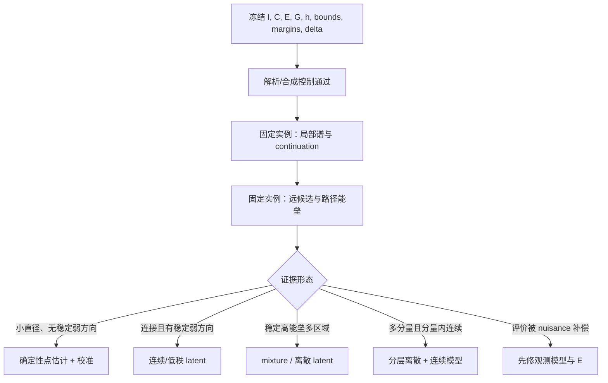

# 固定观测下相机轨迹的可辨识性、近最优集合几何与连通性

> **研究状态声明**：本文建立一个新问题的理论地基。当前分支尚未运行任何
> 解空间拓扑实验，也没有证据证明 VGGT 的固定观测相机解是唯一、连续冗余
> 或由多个断开分量组成。旧实验分支的结果不作为本文命题的前提。

## 0. 执行摘要

我们真正要回答的不是“长序列和短序列谁更稳”，也不是“换几个随机种子能否
得到不同输出”，而是：

> 在图像、帧顺序、预处理、内外部约束和评价目标全部固定后，去除坐标 gauge
> 的相机轨迹近最优集合有多大、是否存在大尺度可行路径、是否分成多个道路
> 连通分量，以及局部是否存在弱可辨识方向？

一个方便的初始写法是

$$
\mathcal S_\epsilon(I)
=\{T\mid E(I,T)\le \epsilon\}/G,
$$

但它还不够严谨。第一，`固定 I` 必须包含完整输入协议；第二，能量通常还依赖
未知场景几何；第三，gauge 群 $G$ 依赖传感器和锚点；第四，只要
$\epsilon>\min E$ 且存在严格可行点，连续能量的子水平集通常含开邻域，因此
它在局部是**满维厚集合**，不能直接称为低维流形。

所以本文不再把问题写成“近似唯一 / 连续低维 / 离散分支”的互斥三选一。实验
上先预注册绝对能量阈值 $h$，令 $\mathcal S_h=\{q:\bar E(q)\le h\}$，再测量
四个相互独立的对象：

$$
\Xi(I;h,\delta,\tau)
=\bigl(D_h,\ \beta_0(\mathcal S_h),\
\ \mathcal H_{h,\delta},\ k_{\mathrm{weak}}(\tau)\bigr).
$$

- $D_h$：去 gauge 后可接受集合的直径；
- $\beta_0$：道路连通分量数；
- $\mathcal H_{h,\delta}$：相距至少 $\delta$ 的候选对之间的 minimax 高度
  剖面/矩阵；
- $k_{\mathrm{weak}}$：局部弱可辨识方向数。

这四个量允许混合情况：例如两个断开分量中的每一个都可能包含连续弱方向。
研究结论只有在同一固定条件下、通过独立能量验收并进行 gauge 对齐后才成立。

当前最重要的下一步不是训练 Diffusion 或 Flow Matching，而是依次完成：

1. 冻结数学对象和评价协议；
2. 用解析/合成正负控制验证测量管线；
3. 在固定实例上测局部弱方向；
4. 对远距离可行候选做路径和能垒检验；
5. 最后才根据证据选择确定性、连续 latent、mixture 或生成式模型。

## 1. 新分支与当前仓库的实际边界

### 1.1 继承父分支，但不继承旧问题命名与结论

本研究线不是 orphan branch。它从稳定父分支创建：

```text
origin/main@15e96cc
└── codex/camera_solution_space_01_theory_foundation
```

它继承 `origin/main` 中的 VGGT 基线代码和通用仓库规范，但 014–023 等旧实验
分支的专属提交不在本分支祖先链中。旧 long-vs-short、context drift 或 residual
topology 观察最多作为“为什么要问这个问题”的背景，不作为固定条件多解的证据。

### 1.2 当前代码究竟提供了什么

当前 `VGGT.forward()` 接收图像序列，并由 Camera Head 输出：

- 最终 `pose_enc`，形状为 `[B,S,9]`；
- `pose_enc_list`，默认包含 4 次迭代细化状态；
- 同时可输出 depth、point map 和 track 等几何预测。

9 维相机编码由 3 维平移、4 维四元数和 2 维 FoV 构成。Camera Head 从
learned empty pose 开始，重复执行 pose-conditioned modulation、Transformer
trunk、9D residual 累加和激活。这个事实有三个直接含义：

1. `pose_enc_list` 是**同一次确定性解码中的中间迭代**，不是四个独立样本；
2. 当前仓库给出的是估计器 $\widehat T_\theta(I)$，不是可接受解集合
   $\mathcal S_\epsilon(I)$；
3. 仓库目前没有统一的 $E$、gauge quotient、候选枚举器、路径连通检验或
   分量证书。

因此，当前分支的真实实验结论是：**没有结论，问题仍然开放。** 这不是缺失，
而是本理论分支有意设置的起点。

### 1.3 本文不做什么

- 不声称不同序列长度证明了固定条件多模态；
- 不把优化器多 basin 当成解集断开；
- 不把随机模型输出簇当成 posterior 或拓扑分量；
- 不提出立刻替换 VGGT Camera Head；
- 不在本阶段启动 DP、FM 或多分支训练；
- 不把 Ground Truth 直接塞进候选发现能量后再宣称“图像决定唯一解”。

## 2. 对象冻结协议

### 2.1 固定观测不是只固定图片文件名

令

$$
I=(I_1,\ldots,I_N).
$$

一次“固定条件”实验必须冻结并散列以下内容：

- 图像像素、帧 ID、顺序和序列长度 $N$；
- resize、crop、归一化、颜色空间和分辨率；
- 内参、畸变模型、时间戳、rolling-shutter 假设；
- 动态物体、天空、遮挡和可见性 mask；
- 已知尺度、重力、地图、首尾姿态等外部约束；
- 所有 residual、权重、robust loss、正则和阈值；
- 若评价有随机性，还要固定随机源，或明确定义期望/高概率能量。

把这些统称为条件 $C$。后文所有集合应理解为
$\mathcal S_\epsilon(I,C)$。改变帧数、顺序、mask、内参或 prompt，就已经换了
条件问题。

### 2.2 轨迹空间、内参与 nuisance variables

若只估计固定内参下的离散外参轨迹，可取

$$
\mathcal T_N=SE(3)^N,\qquad \dim\mathcal T_N=6N.
$$

令第 $i$ 帧 camera-to-world 位姿为 $T_i=(R_i,c_i)$。如果内参也未知，则状态
应扩展为 $q=(T,K)$，而不能把 FoV 变化悄悄算进外参轨迹。

多视图评价通常还依赖场景几何、深度、对应、可见性或动态物体状态，记为
$Z\in\mathcal Z$。合理的起点是联合能量

$$
\ell_{I,C}(T,Z)
=\sum_j w_j\,\rho_j\!\left(r_j(I,C,T,Z)\right)+R_C(T,Z).
$$

若只想研究轨迹，可定义 profile energy

$$
E_{I,C}(T)=\inf_{Z\in\mathcal Z_C}\ell_{I,C}(T,Z).
$$

但必须记录两个风险：最优 $Z$ 的切换可使 $E$ 不光滑；错误 pose 也可能被错误
depth、对应或内参补偿。局部 Jacobian 理论应优先在联合空间 $(T,Z)$ 或固定的
光滑活动分支上使用。

### 2.3 硬约束与合法路径

硬约束定义轨迹可行域

$$
\mathcal M_C
=\{T\in\mathcal T_N:h_C(T)=0,\ a_C(T)\le0\}.
$$

路径必须位于合法相机流形和硬约束中。旋转应使用 $SO(3)$ geodesic、Lie group
更新或其他合法 chart；在 9D pose encoding 上直接做线性插值可能产生非单位
四元数、错误 FoV 或不具有物理意义的中间轨迹。

### 2.4 理论相对阈值与实验绝对阈值

令

$$
E^*_{I,C}=\inf_{T\in\mathcal M_C}E_{I,C}(T).
$$

理论分析可定义相对近最优集合

$$
\widetilde{\mathcal S}_\epsilon(I,C)
=\{T\in\mathcal M_C:E_{I,C}(T)\le E^*_{I,C}+\epsilon\},
$$

但真实高维问题通常不知道 $E^*$。实际实验必须预注册具有明确物理/统计含义的
绝对验收阈值 $h$，直接研究

$$
\widetilde{\mathcal S}_h(I,C)
=\{T\in\mathcal M_C:E_{I,C}(T)\le h\}.
$$

同时维护全局最优值的有效界

$$
L^*\le E^*\le U^*,
$$

其中 $U^*$ 来自当前最好 incumbent，$L^*$ 来自松弛、全局界或可认证下界。
只有在这个 gap 有意义时，才能把 $h$ 换算成相对容差；此时

$$
\epsilon=h-E^*\in[h-U^*,\ h-L^*].
$$

令 $m_{\mathrm{eval}}$ 表示重复评价/数值误差，
$m_{\mathrm{opt}}=U^*-L^*$ 表示最优性 gap，并保守取
$m_{\mathrm{tot}}=m_{\mathrm{eval}}+m_{\mathrm{opt}}$。相对最优结论使用
$m_{\mathrm{tot}}$；只陈述绝对 $h$-sublevel 时至少使用 $m_{\mathrm{eval}}$。
能量落在 $[h-m,h+m]$ 的候选属于灰区，不参与强拓扑结论。若某结论在
$\epsilon\in[h-U^*,h-L^*]$ 内改变，只能按 $h$ 条件报告，不能写成稳健的
“近最优结构”。$h$、界、能量归一化和误差余量均须事前写入 objective card。

## 3. Gauge 与商空间

### 3.1 Gauge 是结构性坐标冗余，不是数据偶然对称

若群 $G_C$ 对联合状态的作用满足

$$
F_C(g\!\cdot\!(T,Z))=F_C(T,Z),\qquad
\ell_{I,C}(g\!\cdot\!(T,Z))=\ell_{I,C}(T,Z),
$$

则同一群轨道代表同一物理状态。经典 BA 中的 gauge freedom 和 projective
ambiguity 可参见 Triggs 等、Hartley 以及 Hartley--Zisserman
[@triggs2000bundle; @hartley1994projective; @hartley2004multiple]。

常见设置如下：

| 设置 | 典型 gauge | 备注 |
|---|---:|---|
| 标定单目、轨迹与场景联合未知、无尺度/世界锚点 | $\mathrm{Sim}^{+}(3)$ | 3 平移 + 3 旋转 + 1 尺度 |
| 已知度量尺度但无世界坐标锚点 | $SE(3)$ | scale 被外部信息破除 |
| 固定度量地图或完整绝对锚点 | 平凡群或更小子群 | 不能再机械减 7 DoF |
| 未标定 projective SfM | $PGL(4)$ | 状态不再是纯 $SE(3)^N$ |
| 测量图有 $K$ 个不耦合连通块 | 可能为 $G^K$ | 每个块有独立坐标自由度 |

重复纹理、镜像场景、对象置换、critical motion [@sturm1997critical] 或某幅图像的特殊对称通常是
**数据相关歧义**，不应自动作为 gauge 除掉。商掉它们会把真正要研究的候选
错误合并。critical configurations 正是在去除通常的 projective gauge 后仍存在
不等价重建 [@hartley2007critical]。

### 3.2 Quotient 与距离

从联合状态商到轨迹商需要额外条件。本文只有在 $G_C$ 的联合作用可写成
$g\!\cdot\!(T,Z)=(g\!\cdot T,g\!\cdot Z)$、保持 $\mathcal M_C$ 与
$\mathcal Z_C$，并满足

$$
E_{I,C}(g\!\cdot T)=E_{I,C}(T)
$$

时，才令该作用诱导到轨迹空间并定义

$$
Q_C=\mathcal M_C/G_C,
\qquad
\mathcal S_h(I,C)
=\widetilde{\mathcal S}_h(I,C)/G_C.
$$

若作用不能只依赖 $T$，则必须商联合可行状态 $(T,Z)$，不能擅自写
$\mathcal M_C/G_C$。以下也默认 $\mathcal M_C$ 本身是正则流形，或明确限制在
一个正则 active stratum。

若 $d_{\mathcal T}$ 对 $G_C$ 等距不变，作用 proper 且轨道闭，则可以定义代表元
无关的 quotient metric

$$
d_Q([T],[T'])
=\inf_{g\in G_C}d_{\mathcal T}(T,g\!\cdot T').
$$

$d_{\mathcal T}$ 需要明确旋转 geodesic、平移尺度、时间加权和缺帧处理。普通
平移欧氏距离并不对 $\mathrm{Sim}(3)$ 的尺度作用不变；条件不满足时，上式只能称
为预注册的 **alignment discrepancy** $d_{\rm align}$，不能冒充内禀 quotient
metric，后文的“直径”也必须相应改称最大对齐差异。若固定首帧和尺度只是选择
representative，就不能在已经 gauge-fixed 的空间里再次减掉同一自由度。

当 $\mathcal M_C$ 是流形且群作用光滑、自由并 proper 时，$Q_C$ 是流形，且

$$
\dim Q_C=\dim\mathcal M_C-\dim G_C.
$$

该商流形结论与维数公式可见 Lee [@lee2013smooth]。存在非平凡稳定子时，这个
定理及维数公式不再直接适用；本文只能在另行指定的正则层上使用局部流形论。

### 3.3 表示冗余不是物理解分支

- 四元数 $q$ 与 $-q$ 表示同一个旋转；
- raw quaternion 不归一化是非法状态，不是连续解；
- Euler 角的 $2\pi$ 周期和奇点是 chart 问题；
- VGGT 的 4 次 pose refinement 是迭代状态，不是四个 component。

所有聚类和路径检验必须在物理空间或正确 quotient 上完成，而不是直接对 raw
9D encoding 做欧氏聚类。

## 4. 精确解集、最优集与正容差子水平集

### 4.1 四个不同对象

只有 residual 本身在群轨道上相容时，才存在 quotient residual
$\bar r:Q_C\rightarrow\mathbb R^m$；仅有标量能量 gauge-invariant 并不足以
推出 $\bar r$ 存在。以下命题假定 $\bar r$ 已合法下降到 quotient，且
$\bar E=\|\bar r\|^2$。否则应直接对 joint state 或 gauge-fixed representative
陈述。必须区分：

1. 精确 residual fiber：
   $\mathcal Z_0=\{q:\bar r(q)=0\}$；
2. 全局最优集：
   $\mathcal M^*=\arg\min_q\bar E(q)$；
3. 理论相对子水平集：
   $\mathcal S_\epsilon=\{q:\bar E(q)\le E^*+\epsilon\}$；
4. 实验绝对子水平集：
   $\mathcal S_h=\{q:\bar E(q)\le h\}$。

真实有噪图像下 $\mathcal Z_0$ 可能为空，而 $\mathcal M^*$ 仍可能非空；只有
infimum 被取得时 $\mathcal M^*$ 才存在，通常需要紧性、coercivity 或其他
attainment 条件。只有 $\mathcal M^*\neq\varnothing$ 时，正容差集合才可称为最优
集的增厚；无论如何，其厚度本身不能被解释成物理连续冗余。

### 4.2 命题 A：局部 exact fiber 的维数

若 $q_*\in\mathcal Z_0$，$Q_C$ 在 $q_*$ 附近是 $d$ 维流形，$\bar r$ 已合法下降
到 quotient、为 $C^1$，且
$D\bar r$ 在邻域恒秩 $\rho$，则常秩定理给出

$$
\dim_{q_*}\mathcal Z_0=d-\rho,
\qquad
T_{q_*}\mathcal Z_0=\ker D\bar r(q_*).
$$

因此只有在**去 gauge、约束正则、残差光滑并且邻域常秩**时，Jacobian nullity
才能解释为 exact fiber 的局部连续非可辨识维数。只在一个点看到小奇异值不够：
$r(x)=x^2$ 在 $x=0$ 处 Jacobian 为零，但零集仍是孤立点。

### 4.3 命题 B：正容差集合通常是满维厚集合

若 $\bar E$ 连续且 $\bar E(q)<h$，则严格子水平集的开放性保证 $q$ 周围存在一个
开邻域仍属于 $\mathcal S_h$。所以在 $d$ 维正则层上的每个严格可行点处，
$\mathcal S_h$ 都是局部满维的；相对阈值 $h=E^*+\epsilon$ 时结论相同。

若 $E(x,y)=(x^2+y^2-1)^2$，精确最优集是 1 维圆；当
$0<\epsilon<1$ 时相对子水平集是 2 维圆环，$\epsilon\ge1$ 时则是圆盘。由此
得到本文最重要的术语修正：

> 不再说“$\mathcal S_\epsilon$ 是低维流形”；应说 exact minimizer/fiber 可能
> 低维，或者近最优厚集合在给定尺度上具有低维骨架、弱方向或细管结构。

### 4.4 命题 C：局部闭性、紧性与解存在

若 $\bar E$ 连续，则 $\mathcal S_h$ 是闭集；但闭不等于紧。若 quotient 后仍有
可逃向无穷的方向，直径和最优解可能不存在。需要额外的 coercivity、properness
或显式有界物理域，才能保证近最优集合紧和 infimum 取得。

## 5. 四量描述，而不是互斥三分类

### 5.1 商空间直径

$$
D_h
=\sup_{a,b\in\mathcal S_h}d_Q(a,b).
$$

给定实际意义阈值 $\delta$，只有 $D_h\le\delta$ 才能称
“$\delta$-近似唯一”。找到一对能量留有数值余量且距离大于 $\delta$ 的候选，
足以反证近似唯一；多启动没有找到第二解则不能证明唯一。

### 5.2 道路连通分量数

$$
\beta_0(\mathcal S_h)
=\#\pi_0^{\mathrm{path}}(\mathcal S_h).
$$

本文研究的是可由合法连续轨迹变形连接的 path components。有限样本的 cluster、
UMAP 图上的空隙或优化终点簇都不是 $\beta_0$ 的直接估计。若问题属于半代数或
局部道路连通的 tame 设置，connected 与 path-connected 才更容易对应。

### 5.3 Minimax 能垒

对候选 $a,b\in\mathcal S_h$ 定义绝对 minimax 高度

$$
H(a,b)
=\inf_{\gamma(0)=a,\,\gamma(1)=b}
\sup_{t\in[0,1]}\bar E(\gamma(t)),
$$

其中 $\gamma$ 是合法连续路径，并在每个 waypoint 一致地处理 nuisance variables。
对所有相距至少 $\delta$ 的端点，正式对象是 barrier family

$$
\mathcal H_{h,\delta}
=\{H(a,b):a,b\in\mathcal S_h,\ d_Q(a,b)\ge\delta\}.
$$

有限注册候选 $a_1,\ldots,a_K$ 时，实际报告矩阵 $[H(a_i,a_j)]$ 及每个元素的
上下界 $H_L,H_U$，而不是一个未定义的标量“$B_\epsilon$”。显式构造一条满足
$\sup_t\bar E(\gamma(t))\le h-m$ 的路径，就证明这一对同属 $\mathcal S_h$ 的
一个道路分量；认证到 $H_L>h+m$ 才足以证明这一对在 $\mathcal S_h$ 中断开。
$H<h$ 可推出存在低能路径，$H>h$ 可推出断开，但临界情形 $H=h$ 在 infimum
不取到时未决。这里仅报告绝对 $h$-集合时取 $m=m_{\rm eval}$；换算相对近最优
结论时取 $m=m_{\rm tot}$。找到一条路径只给 $H$ 的上界，严格的全局方法才可能
给下界；路径搜索失败或候选图缺边都不能当作 barrier 下界。只有 $E^*$ 已知或
有足够紧的界时，才另写相对 barrier $B(a,b)=H(a,b)-E^*$。

### 5.4 局部弱可辨识维数

在 quotient 上的局部最优点 $q$，可由加权 Jacobian 的小奇异值、或 Riemannian/
generalized Hessian 的小特征值定义

$$
k_{\mathrm{weak}}(q;\tau)
=\#\{i:\lambda_i(H_Q(q))\le\tau\}.
$$

$\tau$ 必须相对于参数单位、噪声和轨迹度量预注册。小特征值只是候选弱方向，
还要用 perturb--refit、profile energy 和 continuation 检查其能否积成真实
近最优路径。

### 5.5 随 $h$ 的持久性

单一阈值很脆弱。应扫描 $h$，记录 component 的 birth/merge、直径变化和能垒
临界值。只有获得全局子水平拓扑或可认证的 barrier 关系时，才称 0 维
persistence / merge tree [@edelsbrunner2010computational]；有限候选加已找到路径
只能形成**经验候选 merge graph**，图中缺边没有下界含义。若 $E$ 是 proper
Morse 函数，或所扫 interlevel band 紧，子水平拓扑才只在临界值处变化；在非紧
空间，拓扑还可能从无穷远改变。实际非光滑能量应按活动集分层报告。

### 5.6 便于沟通的结果标签

四量是正式结论；下面标签只是摘要，不互斥：

| 标签 | 最低证据 | 建模倾向 |
|---|---|---|
| quotient 后近似唯一 | 小 $D_h$，且没有额外弱方向证据 | 确定性点估计/局部校准 |
| 连通近最优歧义 | 远距离可行端点 + 完整低能路径 | 连续 latent、低秩或 manifold uncertainty |
| 经验分离候选区域 | 多个远距离可行簇，路径搜索尚未找到桥 | 继续做能垒检验，不急于称 branch |
| 认证的断开可行分量 | 距离显著且 minimax barrier 下界越过阈值 | mixture、离散 latent、分层生成 |
| 混合结构 | 多分量且每个分量有弱方向 | 离散分支 + 分支内连续 latent |
| 模型失配 | 好坏由错误深度/动态/内参补偿 | 先修 $E$ 和观测模型 |

## 6. 六类“多样性”必须严格分开

| 名称 | 数学对象 | 能说明什么 | 不能说明什么 |
|---|---|---|---|
| Gauge 非唯一性 | 群轨道 $G\cdot T$ | 多个参数表示同一物理状态 | 物理多解 |
| 局部连续非可辨识 | quotient 后 exact fiber 的曲线/流形 | 固定条件存在连续物理解族 | 全局连通或 prevalence |
| 断开可行分量 | $\pi_0^{\rm path}(\mathcal S_h)$ | 跨分量路径必越阈值 | posterior 有几个 mode |
| 优化 basin | 特定算法动力系统的吸引域 | 求解器对初始化的依赖 | 解集拓扑 |
| Posterior mode | 指定先验、似然和参考测度后的密度峰 | 概率质量的局部峰 | support/component 数 |
| 算法输出多样性 | $\operatorname{Law}(A(I,C,U))$ | 某算法的经验采样行为 | 完整可行集或真实 posterior |

mode 依赖先验、温度和参考测度；连通空间上的密度可以有多个峰。反过来，一个
低质量分量也可能几乎没有 posterior mass。拓扑和概率都需要研究，但不能互换。

## 7. 反例与旧观察的证据审计

### 7.1 四个最小反例

1. $E(x)=x^2$：唯一最小点，但任意 $\epsilon>0$ 的子水平集都是连续区间。
2. $E(x)=(x^2-1)^2$：梯度流有两个吸引 basin；$\epsilon<1$ 时子水平集断开，
   $\epsilon\ge1$ 时连通。
3. $E(x,y)=(x^2+y^2-1)^2$：精确最优集是圆；$0<\epsilon<1$ 时正容差
   集合是满二维圆环，$\epsilon\ge1$ 时是圆盘。
4. $E(x,y,z)=(x^2+y^2-1)^2+(z^2-1)^2$：小阈值下有两个断开分量，
   每个分量内部又有连续圆形最优族。

它们共同说明：唯一性、局部维数、basin 数、mode 数和 component 数是不同轴。

### 7.2 为什么 long-vs-short 不能回答本问题

长度为 $N$ 和 $M$ 的问题分别位于 $SE(3)^N$ 与 $SE(3)^M$，输入、约束数、变量
维数和损失标度都变了。差异可能来自：

- 条件信息增加或减少；
- 图连通性和视差变化；
- 累积误差、归一化或数值条件数；
- 模型的上下文敏感性；
- 长序列近似、显存策略或遮挡比例。

把长序列解投影到共同帧并与短序列比较，可以研究 context sensitivity；但它仍
不能证明任一固定 $I$ 下有多个可接受解。当前“长短对比不够强”的更深层问题
不是需要把长度差拉得更大，而是它原本测的就不是固定条件解空间拓扑。

### 7.3 为什么不同随机输出仍然不够

若固定 $I,C$ 后从随机模型得到多个输出，并由同一个独立 $E$ 验证为可行，那么
远距离候选可以反证近似唯一。但是：

- 输出簇可能是 gauge copies 或表示伪影；
- 两簇之间可能有未采到的低能桥；
- 模型可能漏掉真实 component；
- 若生成器同时定义验收能量，会形成循环论证。

所以随机输出是 candidate proposal，不是 topology oracle。

### 7.4 为什么多个 optimizer basins 仍然不够

对 $E(x)=(x^2-1)^2$，正负初始化分别收敛到 $\pm1$，但当阈值跨过中央鞍点
后，子水平集已经连通。basin 数还会随优化器、步长和参数化改变，而真正的
$\mathcal S_\epsilon$ 拓扑不应依赖求解器。

## 8. MSE、Diffusion 与 Flow Matching 能解决什么

### 8.1 MSE 的准确结论

在欧氏平方损失和总体最优条件下，确定性回归给出条件均值。若固定条件下真实
解以相同概率取 $Y=-1$ 与 $Y=1$，且有效能量为

$$
E(y)=(y^2-1)^2,
$$

则 MSE 解为 $0$，而 $E(0)=1$。这证明：当条件分布跨越非凸有效集时，条件均值
可能无效。

但应避免“任何 MSE 都必然 averaging”的过强说法：有限网络可能 mode-select，
损失也可在流形上定义 intrinsic mean。对旋转，raw 坐标平均甚至可能离开
$SO(3)$。因此 MSE 反例是风险证明，不是对具体 VGGT 行为的既成结论。

### 8.2 Diffusion / score model 的能力边界

Diffusion 和 score-based 方法通过随机反向过程或 score 场建模分布
[@sohldickstein2015deep; @ho2020denoising; @song2021score]。相对于单点 MSE，
它们原则上能输出多个候选，但这只提供**分布表达能力**，不自动保证：

- 所有物理 component 都被训练数据覆盖；
- 样本经过 gauge 处理并满足几何约束；
- 小概率 component 不被 mode dropping；
- 条件信息足够区分数据标注噪声和真实歧义；
- 采样多样性对应有效覆盖而不是无效噪声。

### 8.3 Flow Matching 的额外拓扑提醒

Flow Matching 可训练连续归一化流的向量场，并在采样时积分 ODE
[@lipman2023flow]。对每个固定条件，若这是同维的确定性 ODE，向量场对状态局部
Lipschitz，且解在正、反时间区间都完备，则时间流映射是 homeomorphism；向量场
为 $C^1$ 时才进一步是 diffeomorphism。于是连通 base support 的连续像及其闭包
仍然连通：

> 从连通的 base support 出发，正则可逆 ODE flow 不能精确产生字面意义上断开
> 的 support；它可以用极低密度“桥”逼近分离模式，或在端点奇异/非正则时发生
> 拓扑变化。

标准 Gaussian base 经全局 $\mathbb R^d$ 微分同胚后仍有全空间 support，因此
实践中的“离散分支”更常对应高能/低密度谷，而不是严格的概率 support 断开。
离散 branch 变量、奇异端点、拒绝采样或非连续后处理均不在上述定理内。这个
结论不等于 FM 无法建模多峰分布；它意味着我们必须区分：

- 可行集的道路分量；
- posterior 的密度峰；
- 生成器 support 中极低概率桥；
- 有限采样是否覆盖各个有效区域。

因此“FM 理论上能表示，所以有限数据下一定学会”与“FM 因为连续，所以完全
不能表示多峰”都过强。真正需要的是 component-aware coverage、constraint
validity 和 held-out calibration。

### 8.4 何时才值得引入显式 branch variable

只有在固定条件下发现多个远距离有效候选，并且跨候选的最低可验证能垒稳定高于
预注册阈值时，显式离散 latent、mixture-of-experts 或分层 sampler 才有直接证据。
若只有单一连接的弱方向，连续 latent、低秩协方差、manifold sampler 或局部
profile 更自然。若近似唯一，则 deterministic head 加校准可能已经足够。

## 9. 可证伪假设与证据等级

设 $m_{\rm eval}$ 是能量评价的数值/统计余量，
$m_{\rm opt}=U^*-L^*$ 是最优性 gap，$m_{\rm tot}=m_{\rm eval}+m_{\rm opt}$；
$\delta$ 是下游有意义且大于重复性噪声的轨迹差阈值。下表按相对近最优结论
保守使用 $m_{\rm tot}$；若只声称绝对 $\mathcal S_h$ 的结构，可将其替换为
$m_{\rm eval}$。

| 声称 | 操作定义 | 能确认/反证它的证据 |
|---|---|---|
| $\delta$-近似唯一 | $D_h\le\delta$ | 两个满足 $E\le h-m_{\rm tot}$ 且 $d_Q>\delta$ 的点足以反证；确认需要全局覆盖或证书 |
| 连通近最优歧义 | 远端点间存在完整合法低能路径 | 构造路径的认证上界 $H_U\le h-m_{\rm tot}$ 可确认该对同分量 |
| 断开可行分量 | 两候选属于 $\mathcal S_h$ 的不同道路分量 | 一条低能路径立即反证；确认需要 minimax 高度的可靠下界 $H_L>h+m_{\rm tot}$ |
| 精确连续非可辨识 | quotient 后 exact fiber 正维 | 邻域常秩 + continuation 保持 exact residual；单点小特征值不够 |
| 弱可辨识方向 | 有稳定小曲率和大 profile 范围 | 改变参数单位或轻微扰动后消失会反证其稳健性 |
| 目标数据上普遍 | 发生比例超过预注册 $p_*$ | 用分层场景的置信区间；挑选案例不能确认 |

证据具有不对称性：

- 一个远距离可行对足以否定近似唯一；
- 一条完整低能路径足以证明这一对同分量；
- 没找到远解不能证明唯一；
- 路径搜索失败不能证明断开。

## 10. 递进研究路线与 go/no-go 门槛

### Stage 0：理论与协议冻结（当前分支）

交付物：本文、符号表、gauge/能量 contract、候选结论用语和停止规则。

**Go 条件**：团队对 $(I,C)$、状态空间、nuisance 处理、$G_C$、$d_Q$、$E$、
$h$、$L^*$、$U^*$、$m_{\rm eval}$、$m_{\rm opt}$、$m_{\rm tot}$ 和 $\delta$
达成书面一致，并规定灰区如何处置。

**No-go**：任何一个对象仍可在看到结果后改变，或把旧结果当成新命题的证明。

### Stage 1：能量验证与解析/合成控制

至少构造：

1. 唯一且良态的控制；
2. 已知 exact 连续歧义；
3. 已知有限离散对称解；
4. 多分量且分量内连续的混合例子；
5. gauge 副本和表示副本的负控制。

验证内容：gauge invariance、阈值重复性、候选排序、合法路径、已知拓扑检出率。

**Go 条件**：所有解析控制分类正确；随机合成控制达到预注册检出率（建议至少
95%）。

**No-go**：gauge 副本对齐不到近零；同一点能量波动跨越阈值；或在已知应唯一、
观测模型已覆盖真值的控制中，错误 pose 仍能靠协议明确禁止的 nuisance 补偿而
获得同分。若 nuisance 合法且控制并未保证唯一，这种补偿可能正是真实
non-identifiability 或模型失配证据，不能一概判成管线失败。

### Stage 2：固定实例的局部几何

- 在同一 $(I,C)$ 上联合优化或一致 profile $Z$；
- 去除 gauge 后计算 Jacobian spectrum / generalized Hessian；
- 沿小曲率方向 perturb--refit；
- 用 continuation 检查一级 null direction 是否能积成路径；
- 在邻域检查秩稳定，而不是只看一个点。

**Go 条件**：弱方向在多参数化、多微扰尺度和独立 residual 分解下稳定。

### Stage 3：固定实例的全局候选与能垒

- 多启动、多求解器、对称性初始化和弱方向 continuation；
- VGGT/生成模型只作为 proposal，统一由独立 $E$ 重评；
- quotient alignment 后按 $d_Q$ 聚类；
- 对远候选使用 geodesic interpolation、string/elastic-band/NEB 类路径优化；
- 自适应加密 waypoint，并一致重优化 nuisance variables；
- 扫描 $h$；有限候选与已找到路径形成经验候选 merge graph，只有全局拓扑或
  barrier 关系被认证后才报告 component merge tree。

**允许写入论文的最低表述**：

- 找到远距离有效对：`近似唯一已被反证`；
- 找到完整低能路径：`这一候选对位于同一道路分量`；
- 只有路径优化失败：`经验分离候选区域`；
- 获得可靠 barrier 下界：才可写 `断开可行分量`。

### Stage 4：跨实例 prevalence 与模型选择

在预注册场景层上重复 Stage 2–3，报告事件比例和置信区间。只有歧义 prevalence
达到预设业务阈值，且多假设模型在 held-out 有效覆盖、校准或下游 regret 上有
收益，才进入正式模型训练。



## 11. 三人递进分工

三部分不是平行堆结果，而是有明确依赖的证据链。

### Part A — 数学对象、Gauge 与合成真值（负责人 A）

任务：

- 冻结状态空间、群作用、quotient metric 和合法路径；
- 写出 exact fiber、最优集、子水平集和四量定义；
- 实现 gauge/representation 正负控制；
- 建立四类解析/合成已知拓扑案例；
- 给出哪些命题是定理、哪些只是数值证据。

交付物：`formal_contract`、合成真值规范、gauge 单元测试、术语审查表。

完成门槛：B 和 C 能在不猜测的情况下调用相同 $G_C$、$d_Q$ 与路径定义。

### Part B — 独立能量、数据冻结与阈值校准（负责人 B）

任务：

- 设计不与候选生成器循环同源的 $E$；
- 明确 scene/depth/correspondence nuisance 是联合、profile 还是 marginal；
- 建立 fixed-condition manifest 和内容 hash；
- 分解 reprojection、cheirality、depth/point consistency、动态 mask 等 residual；
- 预注册绝对阈值 $h$ 与灰区，维护 $L^*\le E^*\le U^*$；
- 估计 $m_{\rm eval}$、$m_{\rm opt}$ 与 $m_{\rm tot}$，预注册 $\delta$；
- 检查错误 pose 是否能被 nuisance 补偿。

交付物：`objective_card`、数据 manifest schema、阈值校准报告、独立验收接口。

完成门槛：解析/合成控制中，好解、坏解和已知路径能被稳定排序。

### Part C — 候选发现、连通性与模型决策（负责人 C）

任务：

- 在完全相同的 $(I,C)$ 上做多启动/多 proposal 候选发现；
- quotient alignment、距离矩阵和聚类只用于候选组织；
- 运行 continuation、string/NEB、minimax path 和 $h$-persistence；
- 区分上界证据、下界证据和搜索失败；
- 在跨实例阶段报告 prevalence 与置信区间；
- 根据证据填模型选择矩阵，不提前承诺 DP/FМ。

交付物：候选注册表、路径证书/失败日志、经验候选 merge graph；只有获得认证时
才交付 merge tree；以及最终模型决策 memo。

完成门槛：任何“branch/component”表述都能追溯到固定条件、独立能量、gauge
对齐和能垒证据。

### 协作顺序

```text
Part A 锁定数学 contract
        ↓
Part B 锁定 E、nuisance 与阈值
        ↓
Part A + B 共同运行控制并签署 Go gate
        ↓
Part C 才能搜索候选并检验路径
        ↓
A+B+C 联合决定是否需要生成式建模
```

正式数值实验和任何训练统一放在 H20；本机只承担文档、静态检查和 PDF 构建，
不设置 CPU smoke 作为正式研究门槛。

## 12. 停止规则与结论语言

出现以下任一情况，应停止拓扑结论并回到协议层：

- 输入、mask、帧序、内参或损失没有被冻结；
- gauge invariance 单元测试失败；
- 同一点的能量噪声大于候选能垒；
- $h$、灰区余量或 $\delta$ 是看结果后选择的；
- 路径离开 $SE(3)$、违反硬约束或没有一致优化 nuisance；
- 生成器和评价器同源而缺少独立验收；
- 只凭二维降维图、有限采样空隙或 optimizer basin；
- 单一实例却声称目标数据上普遍；
- 静态针孔模型被动态、rolling shutter 或未知内参显著破坏。

建议使用的安全语言：

| 证据 | 可以说 | 不可以说 |
|---|---|---|
| 搜索预算内只有一个解 | “未发现远距离可行候选” | “解唯一” |
| 找到两个远距离可行解 | “近似唯一被反证” | “存在离散分支” |
| 找到低能完整路径 | “该候选对同分量” | “整个集合只有一个分量” |
| 多种路径优化都失败 | “经验分离候选区域” | “严格断开” |
| barrier 有可靠下界 | “在给定阈值下断开” | “所有阈值下永久断开” |
| Hessian 有小特征值 | “候选弱方向” | “存在连续解流形” |

## 13. 本理论阶段的验收清单

- [x] 新分支从 `origin/main` 继承，命名与旧实验线分离；
- [x] 明确当前仓库的 Camera Head 是确定性迭代估计器；
- [x] 定义固定条件、状态、nuisance、硬约束和 profile energy；
- [x] 根据传感器/锚点选择 gauge，而不是固定写死 $\mathrm{Sim}(3)$；
- [x] 区分 exact fiber、argmin 和正容差 sublevel；
- [x] 用四量替代错误的互斥三分类；
- [x] 区分 component、mode、basin 和算法输出；
- [x] 给出 MSE、Diffusion 和 FM 的有限结论；
- [x] 给出可证伪假设、证据不对称和停止规则；
- [x] 将后续工作递进地分给三位负责人；
- [ ] Stage 1 能量与合成控制实现；
- [ ] Stage 2 固定实例局部实验；
- [ ] Stage 3 路径与能垒实验；
- [ ] Stage 4 跨实例复现与模型选择。

## 参考文献

1. Wang et al., [VGGT: Visual Geometry Grounded Transformer](https://openaccess.thecvf.com/content/CVPR2025/html/Wang_VGGT_Visual_Geometry_Grounded_Transformer_CVPR_2025_paper.html), CVPR 2025.
2. Hartley, [Projective Reconstruction and Invariants from Multiple Images](https://doi.org/10.1109/34.329005), TPAMI 1994.
3. Hartley and Zisserman, [Multiple View Geometry in Computer Vision](https://www.robots.ox.ac.uk/~vgg/hzbook/), 2nd ed., 2004.
4. Triggs et al., [Bundle Adjustment—A Modern Synthesis](https://doi.org/10.1007/3-540-44480-7_21), 2000.
5. Hartley and Kahl, [Critical Configurations for Projective Reconstruction from Multiple Views](https://doi.org/10.1007/s11263-005-4796-1), IJCV 2007.
6. Sturm, [Critical Motion Sequences for Monocular Self-Calibration and Uncalibrated Euclidean Reconstruction](https://doi.org/10.1109/CVPR.1997.609467), CVPR 1997.
7. Lee, [Introduction to Smooth Manifolds](https://doi.org/10.1007/978-1-4419-9982-5), 2nd ed., 2013.
8. Edelsbrunner and Harer, [Computational Topology: An Introduction](https://doi.org/10.1090/mbk/069), 2010.
9. Sohl-Dickstein et al., [Deep Unsupervised Learning using Nonequilibrium Thermodynamics](https://proceedings.mlr.press/v37/sohl-dickstein15.html), ICML 2015.
10. Ho et al., [Denoising Diffusion Probabilistic Models](https://proceedings.neurips.cc/paper/2020/hash/4c5bcfec8584af0d967f1ab10179ca4b-Abstract.html), NeurIPS 2020.
11. Song et al., [Score-Based Generative Modeling through Stochastic Differential Equations](https://openreview.net/forum?id=PxTIG12RRHS), ICLR 2021.
12. Lipman et al., [Flow Matching for Generative Modeling](https://openreview.net/forum?id=PqvMRDCJT9t), ICLR 2023.
